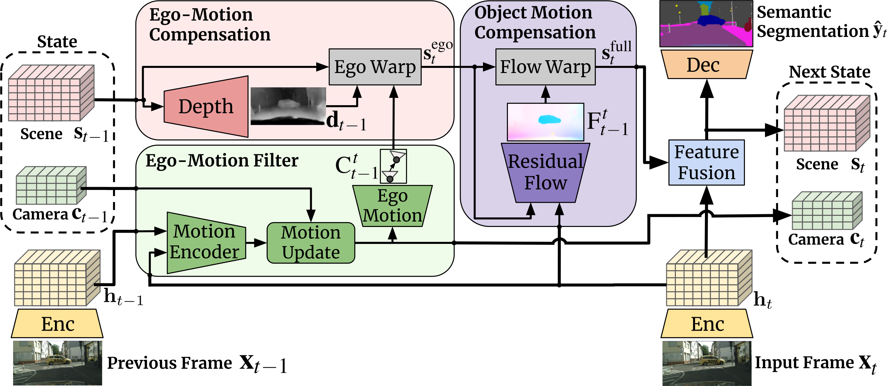
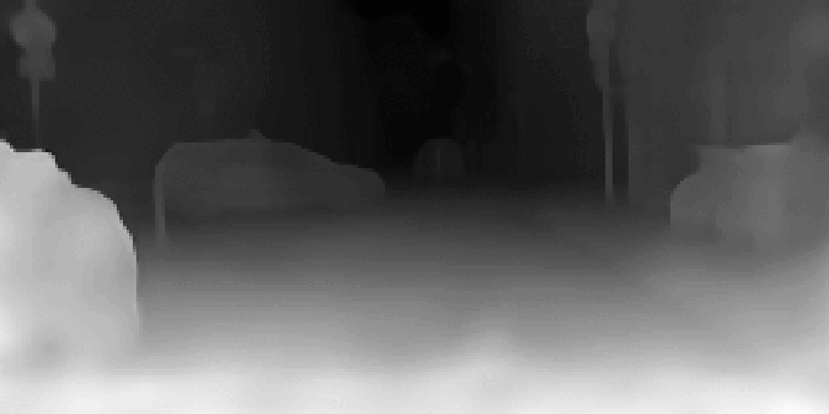
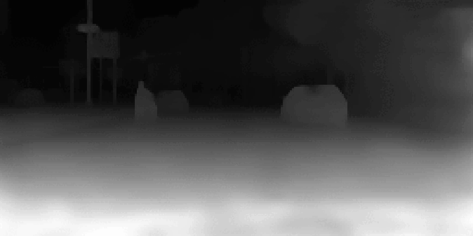

# MCDS-VSS

Official implementation of **'MCDS-VSS: Moving Camera Dynamic Scene Video Semantic Segmentation by Filtering with Self-Supervised Geometry and Motion'** [[Project Page](https://sites.google.com/view/mcds-vss/home)]
[[Paper](https://arxiv.org/abs/2405.19921v1)]


<p float="left">
  
</p>

<p float="left">
  
  
  
  
</p>
<p float="left">
  
  
  
  
</p>


#### Code Coming Soon


## Contact and Citation

This repository is maintained by [Angel Villar-Corrales](http://angelvillarcorrales.com/templates/home.php).

Please consider citing our paper if you find our work or our repository helpful.

```
@article{MCDS-VSS,
  title={MCDS-VSS: Moving Camera Dynamic Scene Video Semantic Segmentation by Filtering with Self-Supervised Geometry and Motion},
  author={Villar-Corrales, Angel and Austermann, Moritz and Behnke, Sven},
  journal={arXiv preprint arXiv:2405.19921},
  year={2024}
}
```

In case of any questions or problems regarding the project or repository, do not hesitate to contact the authors at villar@ais.uni-bonn.de.
